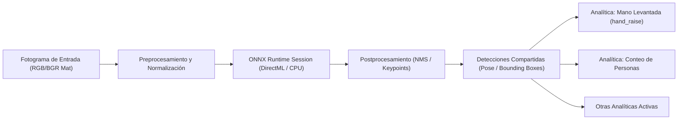

# VisionControl Edge — Pipeline de Inteligencia Artificial e Inferencia

## 1. Flujo de Inferencia Compartido

Para maximizar la eficiencia y reducir el consumo de memoria VRAM y CPU, VisionControl Edge implementa un **pipeline de inferencia compartido por cámara**:

---

## 2. Analíticas Disponibles y sus Esquemas de Parámetros

### `hand_raise` (Detección de Mano Levantada)
- **Modelo Base**: YOLOv8-Pose / MoveNet
- **Parámetros Soportados**:
  - `raise_threshold_y` (número, `0.0` a `1.0`): Umbral de elevación relativa de muñeca respecto al hombro.
  - `min_arm_confidence` (número, `0.0` a `1.0`): Confianza mínima en los puntos clave de hombro/codo/muñeca.
  - `min_duration_seconds` (número, `>= 0.0`): Tiempo mínimo continuo con la mano arriba antes de disparar el evento.
  - `require_face_visible` (booleano): Requiere que el rostro o la cabeza estén detectados.

> [!IMPORTANT]
> El formulario de configuración en el Desktop y en React es **100% data-driven**. La interfaz consulta el esquema formal de parámetros mediante `GET /api/v1/analytics/definitions` y envía únicamente los parámetros definidos para esa analítica.

---

## 3. Asignación Espacial (Zonas y Líneas)

Las analíticas pueden ser globales (toda la imagen) o estar restringidas a geometrías específicas:
- **Zonas Poligonales y Rectángulos**: La detección se evalúa únicamente si el punto central (o los puntos clave requeridos) caen dentro del polígono delimitado.
- **Líneas Virtuales**: Para analíticas de cruce de línea y conteo direccional (ej. Entrada / Salida).
- **Coordenadas Normalizadas**: Todas las geometrías se definen con puntos normalizados en el rango $[0.0, 1.0]$, garantizando independencia de la resolución del sensor.

## Detectores personalizados: frontera de Fase 1

El builtin actual es YOLO26 Nano Pose según código y manifiesto. [Training Lab](CUSTOM_MODEL_TRAINING.md) exporta YOLO26 **detect** raw ONNX y valida su contrato en CPU. El postprocesador existente soporta cero keypoints y clases variables; el servicio de prueba resuelve nombres desde metadata custom. El host y las analíticas live siguen orientados a pose/personas: registrar un detector no lo aplica a cámaras ni le atribuye pose/tracking.
