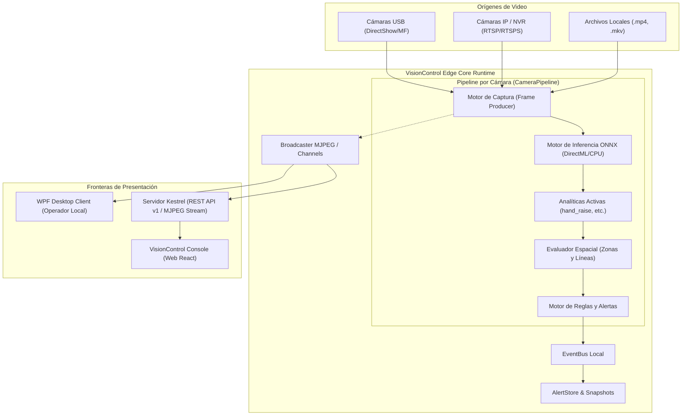

# VisionControl Edge — Arquitectura del Sistema

## 1. Diagrama de Arquitectura Global

---

## 2. Capas del Proyecto

### 1. `HandRaise.Domain`
- Entidades puras y enumeraciones: `Camera`, `Zone`, `Line`, `AnalyticDefinition`, `Rule`, `Alert`, `Event`.
- Sin dependencias externas ni de infraestructura.

### 2. `HandRaise.Application`
- Contratos de servicios (`ICameraManagementService`, `IAnalyticService`, `IRuleEngine`, `IAlertStore`, `IEventRepository`).
- DTOs de lectura/escritura (`CameraView`, `CameraWriteRequest`, etc.).
- Orquestación de lógica de negocio independiente de UI o Web.

### 3. `HandRaise.Infrastructure.Windows`
- Ingesta de video con OpenCV / MediaFoundation / DirectShow.
- Inferencia ONNX Runtime con proveedores DirectML y CPU.
- Seguridad: Cifrado DPAPI para almacenamiento local de contraseñas y API Keys.
- Diagnóstico: WMI, contadores de rendimiento de Windows, detección de hardware.

### 4. `HandRaise.Host`
- Runtime de backend desacoplado que puede operar de forma autónoma o embebida.
- Endpoints REST `/api/v1/*` bajo ASP.NET Core Kestrel.
- Streaming HTTP Multipart MJPEG para múltiples clientes concurrentes.
- Manejo de ciclo de vida de sesiones de cámara (`HeadlessEngineService`).

### 5. `HandRaise.Desktop`
- Aplicación de escritorio WPF (.NET 8/9 Windows x64).
- Patrón MVVM con CommunityToolkit.Mvvm.
- Renderizado de video directo sin polling ni flickering.
- Configuración de zonas interactivas en lienzo normalizado (0.0 a 1.0).

---

## 3. Principio de Propiedad y Ciclo de Vida

- **Single Capture Ownership**: Por cada cámara configurada existe como máximo un único objeto de captura (`CameraPipeline`) activo.
- Múltiples suscriptores (UI local, preview de configuración, API MJPEG para React) consumen del mismo buffer de fotogramas generado por la cámara a través de canales no bloqueantes (`Channel<FrameMessage>`).
- Cuando ningún consumidor requiere el stream visual, la inferencia y el análisis continúan ejecutándose en segundo plano sin costo innecesario de compresión JPEG.

## Training Lab V1

El [núcleo de entrenamiento personalizado](CUSTOM_MODEL_TRAINING.md) separa proyectos/datasets/jobs del pipeline live y ejecuta YOLO en un proceso externo. Reutiliza `IModelRegistry` con persistencia custom, sin activar modelos en cámaras. Domain define contratos, Application orquesta e Infrastructure implementa storage/worker/validación ONNX. La UX queda para Fase 2. Los proyectos actuales apuntan a .NET 10; las menciones anteriores a 8/9 son históricas.
