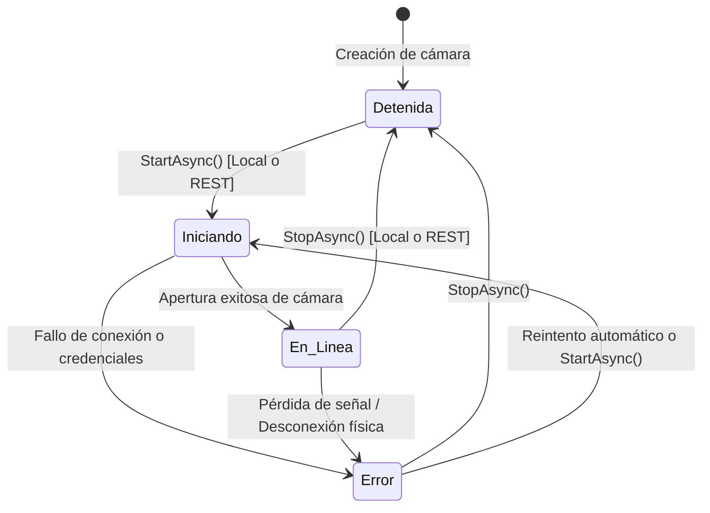

# VisionControl Edge — Ciclo de Vida de Cámaras

## 1. Estados Canónicos de una Cámara

Cada cámara en VisionControl Edge transiciona entre los siguientes estados:

| Estado Canónico | `Enabled` | `Running` | Descripción |
| :--- | :---: | :---: | :--- |
| **En línea** | `true` | `true` | El pipeline de captura está activo, procesando fotogramas, ejecutando inferencia y disponible para streaming MJPEG. |
| **Detenida** | `false` | `false` | El pipeline está detenido. Los hilos de captura están liberados, no se consumen recursos de GPU ni CPU. |
| **Iniciando** | `true` | `false` | Se está negociando la conexión con el hardware o flujo RTSP. |
| **Error / No disponible** | `true`/`false` | `false` | Falló la apertura del stream o se perdió la señal de red. |

---

## 2. Diagrama de Transición de Estados

---

## 3. Operaciones de Inicio (`Start`) y Detención (`Stop`)

### Inicio (`StartAsync`)
1. Comprueba si ya existe un `CameraSession` activo para el `cameraId`. Si ya está corriendo, retorna `Success`.
2. Lee la configuración persisted (origen, credenciales desencriptadas mediante DPAPI, analíticas asociadas, zonas y reglas).
3. Instancia el `CameraPipeline` correspondiente (USB/RTSP/File).
4. Inicializa los modelos de inferencia requeridos en GPU/DirectML o CPU.
5. Inicia el bucle de captura y procesamiento en un hilo desacoplado.
6. Publica el evento `CameraRunningStateChanged` para notificar tanto a la UI WPF como a los clientes REST.
7. Marca el estado en disco como `Enabled: true`.

### Detención (`StopAsync`)
1. Cancela el token de cancelación (`CancellationTokenSource`) del pipeline.
2. Cierra las suscripciones activas de MJPEG (`Channel.Writer.TryComplete()`), cerrando limpiamente las conexiones HTTP de streaming.
3. Libera el hardware de captura (cámara web USB o socket RTSP).
4. Descarga los recursos de inferencia y buffers asociados.
5. Publica el evento `CameraRunningStateChanged` para actualizar la interfaz.
6. Marca el estado en disco como `Enabled: false`.

---

## 4. Sincronización entre WPF y REST

Tanto los botones locales de la interfaz de escritorio como los endpoints remotos de la API REST (`POST /api/v1/cameras/{id}/start`, `POST /api/v1/cameras/{id}/stop`) invocan **exactamente el mismo servicio `ICameraManagementService`**.

Cualquier cambio de estado originado vía REST dispara inmediatamente el evento `CameraRunningStateChanged`, lo que hace que la interfaz WPF actualice al instante:
- Los textos de estado (`En línea` / `Detenida`).
- El color de los indicadores de estado (verde / gris).
- Los botones de acción (`Detener` / `Volver a activar`).
- La reproducción de video local.
