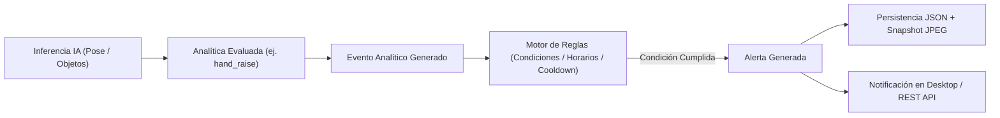

# VisionControl Edge — Eventos, Reglas y Alertas

## 1. Cadena de Procesamiento: Detección → Evento → Regla → Alerta

---

## 2. Eventos Analíticos (`AnalyticEvent`)

Un evento representa un hecho observado en un instante determinado:
- `id`: Identificador único del evento.
- `camera_id`: Cámara donde ocurrió.
- `analytic_type_id`: Tipo de analítica (ej. `hand_raise`).
- `timestamp`: Marca de tiempo UTC.
- `confidence`: Nivel de confianza numérico ($0.0$ a $1.0$).
- `spatial_id`: Zona o línea asociada (opcional).
- `metadata`: Diccionario clave-valor con detalles específicos (ej. duración del gesto, lado del brazo).

---

## 3. Motor de Reglas (`RuleEngine`)

Las reglas definen cuándo un evento debe convertirse en una alerta operacional:
- **Severidad**: `Info`, `Warning`, `Critical`.
- **Condiciones**:
  - Filtro por tipo de evento.
  - Umbral mínimo de confianza.
  - Restricción por zona (`zone_id`).
  - Tiempo de permanencia o conteo acumulado.
- **Mecanismos Anti-Ruido**:
  - `cooldown_seconds`: Tiempo de enfriamiento obligatorio entre alertas sucesivas para evitar inundación (alert storm).
  - `debounce_window`: Ventana de confirmación temporal antes de emitir la alerta.

---

## 4. Alertas y Evidencia Visual (`Alert` & Snapshots)

Cuando una regla se dispara:
1. Se crea la entidad `Alert` con estado `Open`.
2. Se extrae el fotograma actual y se guarda como snapshot JPEG en `%LOCALAPPDATA%\HandRaiseDetection\snapshots\{alert_id}.jpg`.
3. Se publica en el `EventBus` interno.
4. Queda disponible inmediatamente en la pestaña de métricas y a través del endpoint REST `GET /api/v1/alerts`.
