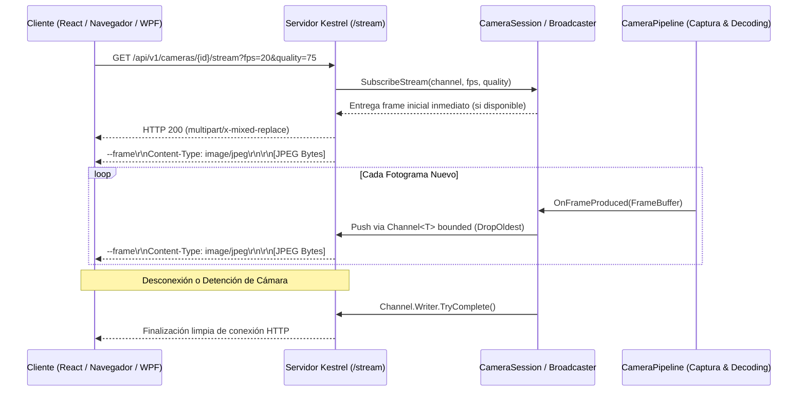

# VisionControl Edge — Transmisión de Video en Vivo y Protocolo MJPEG

## 1. Arquitectura del Servidor de Video MJPEG

El endpoint `/api/v1/cameras/{id}/stream` implementa el estándar HTTP Multipart Motion JPEG (`multipart/x-mixed-replace; boundary=--frame`).

---

## 2. Parámetros de Consulta (`Query Parameters`)

El endpoint de streaming acepta parámetros para optimizar ancho de banda y carga de CPU:

| Parámetro | Tipo | Por Defecto | Rango | Descripción |
| :--- | :---: | :---: | :---: | :--- |
| `fps` | `double` | `15.0` | `1.0` a `60.0` | Tasa máxima de fotogramas por segundo enviada al cliente. |
| `quality` | `int` | `70` | `10` a `100` | Calidad de compresión JPEG (menor calidad = menor ancho de banda). |
| `include_overlays` | `bool` | `true` | `true`/`false` | Determina si se incluyen las cajas de detección y zonas en el video. |

---

## 3. Optimizaciones Críticas para Cero Latencia

1. **Entrega Inmediata de Primer Fotograma**: Al suscribirse a una cámara activa, `CameraSession.SubscribeStream` empuja inmediatamente el último fotograma válido (`_latestFrame`) al canal sin esperar el siguiente ciclo de hardware, garantizando visualización instantánea.
2. **Buffer Bounded con `DropOldest`**: Si el cliente de red es lento o experimenta congestión, los canales descartan automáticamente los fotogramas más antiguos (`BoundedChannelFullMode.DropOldest`). Esto previene la acumulación de latencia (buffer bloat).
3. **Decodificación Asíncrona en WPF**: La aplicación de escritorio utiliza `WriteableBitmap` y `BitmapFrame.Create(stream, BitmapCreateOptions.None, BitmapCacheOption.OnLoad)` en hilos en segundo plano para evitar bloqueos del hilo principal de UI.
4. **Cierre Limpio al Detener**: Al detener una cámara, todos los canales de streaming se completan formalmente (`TryComplete()`), evitando sockets colgados o clientes esperando indefinidamente.
